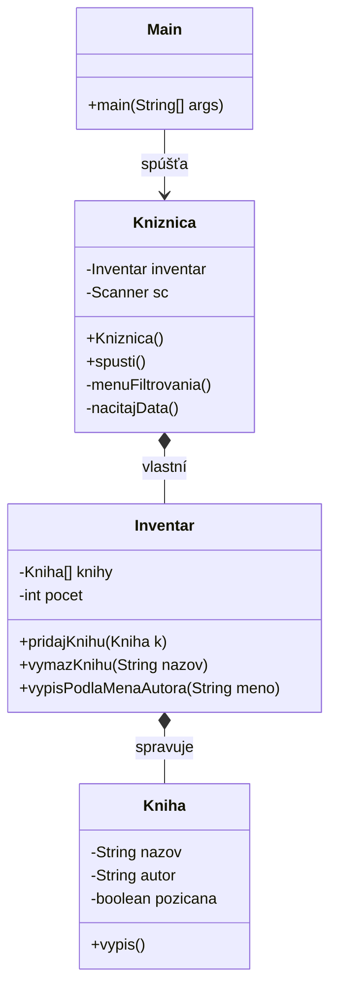

# 📚 Knižnica 

## 1. Účel projektu
Cieľom projektu je vytvoriť jednoduchú konzolovú aplikáciu na správu knižnice v jazyku **Java**.  
Program umožňuje pracovať s inventárom kníh, evidovať ich vypožičanie a zobrazovať rôzne prehľady pomocou textového menu.


---

## 2. Použité technológie a nástroje
- programovací jazyk **Java**
- vývojové prostredie **IntelliJ IDEA**
- verzovací systém **Git**
- repozitár **GitHub**
- konzolové (textové) používateľské rozhranie

---

## 3. Štruktúra projektu
Projekt je rozdelený do viacerých tried, pričom každá trieda má jasne definovanú zodpovednosť.

```
src/
 ├── Main.java        (vstupný bod programu)
 ├── Kniznica.java   (hlavná logika aplikácie a menu)
 ├── Inventar.java   (správa kolekcie kníh)
 └── Kniha.java      (reprezentácia jednej knihy)
```

---

## 4. Spustenie programu
Program sa spúšťa spustením triedy **Main.java**.

Postup v IntelliJ IDEA:
1. Otvoriť súbor `Main.java`
2. Kliknúť na tlačidlo **Run**
3. Program sa spustí v konzole

Po spustení sa automaticky načítajú testovacie dáta a zobrazí sa hlavné menu programu.

---

## 5. Ovládanie programu
Používateľ ovláda aplikáciu pomocou **číselného menu** v konzole.  
Jednotlivé voľby menu umožňujú vykonávať operácie s knihami, ako napríklad ich pridanie, vyradenie alebo vypožičanie.

---

## 6. Funkcionalita aplikácie
Aplikácia umožňuje:
- pridať novú knihu do inventára
- vyradiť knihu z inventára
- požičať knihu na zadaný počet dní
- vrátiť požičanú knihu
- vypísať všetky knihy v inventári
- vypísať iba požičané knihy
- vypísať knihy po prekročení výpožičnej lehoty
- vypísať knihy podľa zvolenej kategórie

---

## 7. Popis tried

### Trieda `Kniha`
Trieda reprezentuje jednu knihu v knižnici.  
Obsahuje základné informácie o knihe a jej stave (či je požičaná alebo nie).

---

### Trieda `Inventar`
Trieda zabezpečuje správu všetkých kníh v knižnici.  
Knihy sú uložené v poli a trieda poskytuje metódy na ich vyhľadávanie, pridávanie, odstraňovanie a výpis.

---

### Trieda `Kniznica`
Trieda obsahuje hlavnú logiku aplikácie a textové menu.  
Spracováva vstupy od používateľa a volá príslušné metódy triedy `Inventar`.

---

### Trieda `Main`
Trieda `Main` predstavuje vstupný bod programu.  
Obsahuje metódu `main`, ktorá spustí aplikáciu.

---

## 8. Testovacie dáta
Program po spustení automaticky načíta testovacie knihy, aby bolo možné aplikáciu okamžite používať bez nutnosti ručného zadávania údajov.

---

## 9. Diagram tried (Class Diagram)
Tento diagram zobrazuje štruktúru objektov v aplikácii.




